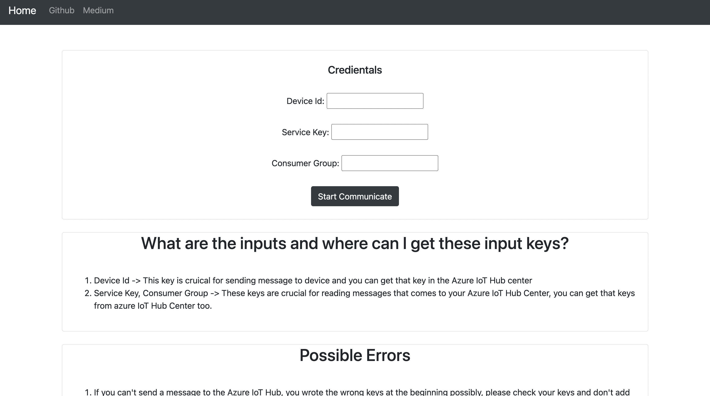
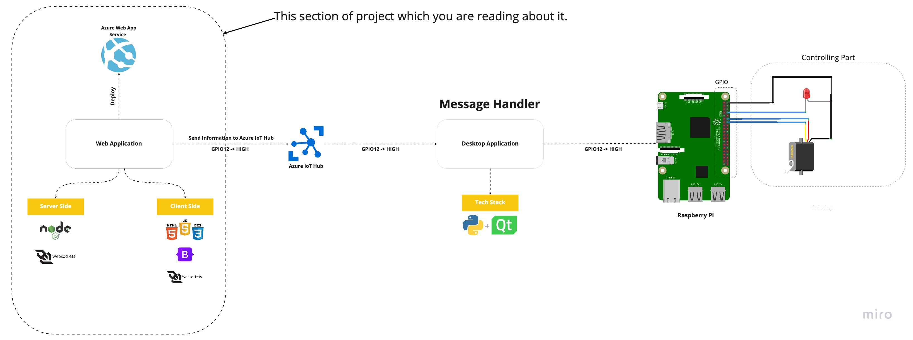

# Message Handler


This is a project that you can download it and if you get the crucial keys which you can get in Azure IoT Hub you can communicate with your device remotely.

## How to Install

- Firstly download the program zip file
- After that install dependecies using this command in bash

```bash
npm install
npm run devStart
 ```
  - When you start the server go to the localhost:3030
  
## Which tools you need to work with this project properly?

* Firstly you need to install this project on your remote device
* Then you need to download the another program which I named connector to your local device that you want to acces remotly
    * You can download it [here](https://github.com/erhan-namli/connector-azurehub-pyqt5)

## Work Diagram



## How to use
 
** STILL WORKING ON **
You can proceed to the application by following the medium article until the Readme section is finished 

[Medium](https://medium.com/@erhan_namli/control-your-raspberry-pi-remotely-over-the-internet-using-microsoft-azure-services-part-2-fa64a40bfd85)
